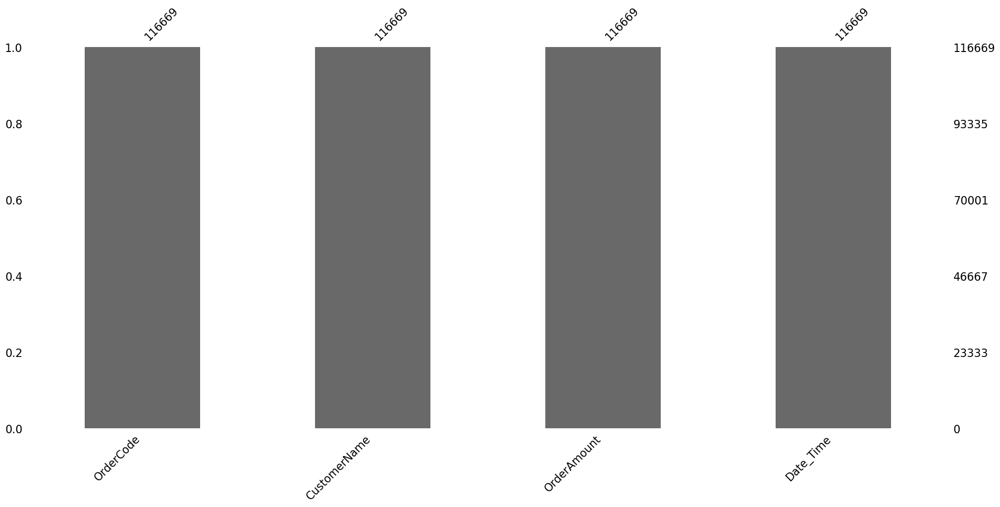
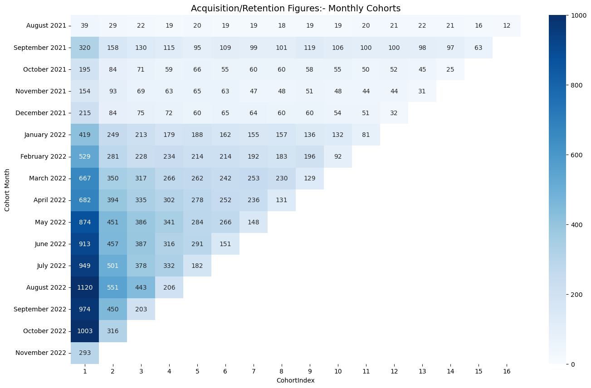
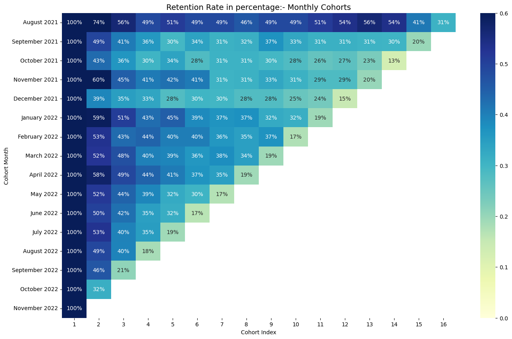
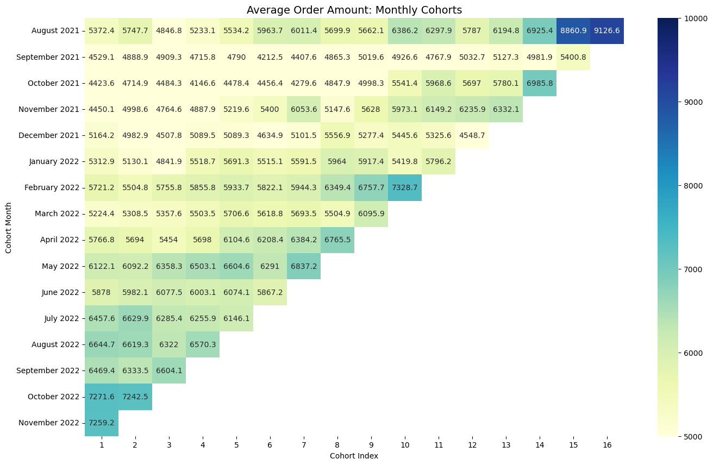

```python
# import libraries 
import pandas as pd
import matplotlib.pyplot as plt
import seaborn as sns 


import numpy as np
import datetime as dt

import missingno as msno
from textwrap import wrap
```


```python
# load in the data and take a look 
data = pd.read_excel(r"C:\Users\PC\Desktop\FC\CSV\FC_cohort_xls.xlsx")
data.info()
```

    <class 'pandas.core.frame.DataFrame'>
    RangeIndex: 116669 entries, 0 to 116668
    Data columns (total 4 columns):
     #   Column        Non-Null Count   Dtype  
    ---  ------        --------------   -----  
     0   OrderCode     116669 non-null  object 
     1   CustomerName  116669 non-null  object 
     2   OrderAmount   116669 non-null  float64
     3   Date_Time     116669 non-null  object 
    dtypes: float64(1), object(3)
    memory usage: 3.6+ MB
    


```python
#Inspect missing values in the dataset
msno.bar(data)
```


    <AxesSubplot:>


    

    


```python
#take a look at the head
data.head()
```


<div>
<style scoped>
    .dataframe tbody tr th:only-of-type {
        vertical-align: middle;
    }

    .dataframe tbody tr th {
        vertical-align: top;
    }

    .dataframe thead th {
        text-align: right;
    }
</style>
<table border="1" class="dataframe">
  <thead>
    <tr style="text-align: right;">
      <th></th>
      <th>OrderCode</th>
      <th>CustomerName</th>
      <th>OrderAmount</th>
      <th>Date_Time</th>
    </tr>
  </thead>
  <tbody>
    <tr>
      <th>0</th>
      <td>0cd6b3</td>
      <td>Victor Williams</td>
      <td>3858.0</td>
      <td>2022-11-07 22:59:36</td>
    </tr>
    <tr>
      <th>1</th>
      <td>bf8a8a</td>
      <td>Folake F</td>
      <td>3058.0</td>
      <td>2022-11-07 22:58:04</td>
    </tr>
    <tr>
      <th>2</th>
      <td>8fce77</td>
      <td>Tega Tega</td>
      <td>5870.0</td>
      <td>2022-11-07 22:54:20</td>
    </tr>
    <tr>
      <th>3</th>
      <td>d8defc</td>
      <td>Emmanuel Emordi</td>
      <td>5968.0</td>
      <td>2022-11-07 22:53:56</td>
    </tr>
    <tr>
      <th>4</th>
      <td>b6d72d</td>
      <td>Anthony Egwu</td>
      <td>5408.0</td>
      <td>2022-11-07 22:52:37</td>
    </tr>
  </tbody>
</table>
</div>


```python
#drop rows with no customer ID
data = data.dropna(subset=['CustomerName'])
data.info()
```

    <class 'pandas.core.frame.DataFrame'>
    RangeIndex: 116669 entries, 0 to 116668
    Data columns (total 4 columns):
     #   Column        Non-Null Count   Dtype  
    ---  ------        --------------   -----  
     0   OrderCode     116669 non-null  object 
     1   CustomerName  116669 non-null  object 
     2   OrderAmount   116669 non-null  float64
     3   Date_Time     116669 non-null  object 
    dtypes: float64(1), object(3)
    memory usage: 3.6+ MB
    


```python
data["Date_Time"] = pd.to_datetime(data["Date_Time"])
```


```python
data.dtypes
```


    OrderCode               object
    CustomerName            object
    OrderAmount            float64
    Date_Time       datetime64[ns]
    dtype: object


```python
#create an invoice month
import datetime as dt
#function for month
def get_month(x):
    return dt.datetime(x.year, x.month,1)
#apply the function 
data['InvoiceMonth'] = data['Date_Time'].apply(get_month)
data.tail()
```


<div>
<style scoped>
    .dataframe tbody tr th:only-of-type {
        vertical-align: middle;
    }

    .dataframe tbody tr th {
        vertical-align: top;
    }

    .dataframe thead th {
        text-align: right;
    }
</style>
<table border="1" class="dataframe">
  <thead>
    <tr style="text-align: right;">
      <th></th>
      <th>OrderCode</th>
      <th>CustomerName</th>
      <th>OrderAmount</th>
      <th>Date_Time</th>
      <th>InvoiceMonth</th>
    </tr>
  </thead>
  <tbody>
    <tr>
      <th>116664</th>
      <td>206400000000</td>
      <td>Henry Nneji</td>
      <td>2300.0</td>
      <td>2021-08-26 14:11:59</td>
      <td>2021-08-01</td>
    </tr>
    <tr>
      <th>116665</th>
      <td>3ba2b0</td>
      <td>Nkechi Innocent</td>
      <td>4100.0</td>
      <td>2021-08-26 13:42:02</td>
      <td>2021-08-01</td>
    </tr>
    <tr>
      <th>116666</th>
      <td>a3cf9c</td>
      <td>Arioghore  Eseoghene</td>
      <td>2510.0</td>
      <td>2021-08-26 13:35:02</td>
      <td>2021-08-01</td>
    </tr>
    <tr>
      <th>116667</th>
      <td>1fa55f</td>
      <td>Ade Adebisi</td>
      <td>6500.0</td>
      <td>2021-08-26 13:12:05</td>
      <td>2021-08-01</td>
    </tr>
    <tr>
      <th>116668</th>
      <td>b8948c</td>
      <td>Tobi Adebomi</td>
      <td>2900.0</td>
      <td>2021-08-26 12:43:56</td>
      <td>2021-08-01</td>
    </tr>
  </tbody>
</table>
</div>


```python
#create a column index with the minimum invoice date aka first time customer was acquired
data['Cohort Month'] =  data.groupby('CustomerName')['InvoiceMonth'].transform('min')
data.head(30)
```


<div>
<style scoped>
    .dataframe tbody tr th:only-of-type {
        vertical-align: middle;
    }

    .dataframe tbody tr th {
        vertical-align: top;
    }

    .dataframe thead th {
        text-align: right;
    }
</style>
<table border="1" class="dataframe">
  <thead>
    <tr style="text-align: right;">
      <th></th>
      <th>OrderCode</th>
      <th>CustomerName</th>
      <th>OrderAmount</th>
      <th>Date_Time</th>
      <th>InvoiceMonth</th>
      <th>Cohort Month</th>
    </tr>
  </thead>
  <tbody>
    <tr>
      <th>0</th>
      <td>0cd6b3</td>
      <td>Victor Williams</td>
      <td>3858.0</td>
      <td>2022-11-07 22:59:36</td>
      <td>2022-11-01</td>
      <td>2022-07-01</td>
    </tr>
    <tr>
      <th>1</th>
      <td>bf8a8a</td>
      <td>Folake F</td>
      <td>3058.0</td>
      <td>2022-11-07 22:58:04</td>
      <td>2022-11-01</td>
      <td>2022-09-01</td>
    </tr>
    <tr>
      <th>2</th>
      <td>8fce77</td>
      <td>Tega Tega</td>
      <td>5870.0</td>
      <td>2022-11-07 22:54:20</td>
      <td>2022-11-01</td>
      <td>2022-05-01</td>
    </tr>
    <tr>
      <th>3</th>
      <td>d8defc</td>
      <td>Emmanuel Emordi</td>
      <td>5968.0</td>
      <td>2022-11-07 22:53:56</td>
      <td>2022-11-01</td>
      <td>2022-07-01</td>
    </tr>
    <tr>
      <th>4</th>
      <td>b6d72d</td>
      <td>Anthony Egwu</td>
      <td>5408.0</td>
      <td>2022-11-07 22:52:37</td>
      <td>2022-11-01</td>
      <td>2022-04-01</td>
    </tr>
    <tr>
      <th>5</th>
      <td>912998</td>
      <td>Samuel Efuwape</td>
      <td>7668.0</td>
      <td>2022-11-07 22:51:40</td>
      <td>2022-11-01</td>
      <td>2022-09-01</td>
    </tr>
    <tr>
      <th>6</th>
      <td>d64df1</td>
      <td>Tayo J</td>
      <td>5118.0</td>
      <td>2022-11-07 22:49:15</td>
      <td>2022-11-01</td>
      <td>2022-07-01</td>
    </tr>
    <tr>
      <th>7</th>
      <td>0abc49</td>
      <td>Temisola Solagbade</td>
      <td>4058.0</td>
      <td>2022-11-07 22:48:45</td>
      <td>2022-11-01</td>
      <td>2022-10-01</td>
    </tr>
    <tr>
      <th>8</th>
      <td>699999999999999981813497856</td>
      <td>Dare Adekoya</td>
      <td>6470.0</td>
      <td>2022-11-07 22:47:15</td>
      <td>2022-11-01</td>
      <td>2022-02-01</td>
    </tr>
    <tr>
      <th>9</th>
      <td>615311</td>
      <td>Osaze Osunde</td>
      <td>2868.0</td>
      <td>2022-11-07 22:41:27</td>
      <td>2022-11-01</td>
      <td>2022-05-01</td>
    </tr>
    <tr>
      <th>10</th>
      <td>b88a36</td>
      <td>Olalekan Ola</td>
      <td>4420.0</td>
      <td>2022-11-07 22:39:14</td>
      <td>2022-11-01</td>
      <td>2022-10-01</td>
    </tr>
    <tr>
      <th>11</th>
      <td>794bc1</td>
      <td>Nodebe Ofodile</td>
      <td>4858.0</td>
      <td>2022-11-07 22:38:15</td>
      <td>2022-11-01</td>
      <td>2022-03-01</td>
    </tr>
    <tr>
      <th>12</th>
      <td>7befe1</td>
      <td>Abiola Awoyeye</td>
      <td>6408.0</td>
      <td>2022-11-07 22:35:54</td>
      <td>2022-11-01</td>
      <td>2022-05-01</td>
    </tr>
    <tr>
      <th>13</th>
      <td>04ba16</td>
      <td>Chu Okonkwk</td>
      <td>7858.0</td>
      <td>2022-11-07 22:30:24</td>
      <td>2022-11-01</td>
      <td>2022-08-01</td>
    </tr>
    <tr>
      <th>14</th>
      <td>067c7e</td>
      <td>Fikemi Segun</td>
      <td>8208.0</td>
      <td>2022-11-07 22:28:41</td>
      <td>2022-11-01</td>
      <td>2022-04-01</td>
    </tr>
    <tr>
      <th>15</th>
      <td>a3a8e2</td>
      <td>Paul Adokiye Iruene</td>
      <td>310.0</td>
      <td>2022-11-07 22:26:30</td>
      <td>2022-11-01</td>
      <td>2021-08-01</td>
    </tr>
    <tr>
      <th>16</th>
      <td>b5b9d5</td>
      <td>Konyekokim Odey</td>
      <td>5268.0</td>
      <td>2022-11-07 22:26:29</td>
      <td>2022-11-01</td>
      <td>2022-04-01</td>
    </tr>
    <tr>
      <th>17</th>
      <td>be9d71</td>
      <td>Paul Adokiye Iruene</td>
      <td>3120.0</td>
      <td>2022-11-07 22:22:05</td>
      <td>2022-11-01</td>
      <td>2021-08-01</td>
    </tr>
    <tr>
      <th>18</th>
      <td>8ab424</td>
      <td>Astro Jr</td>
      <td>5858.0</td>
      <td>2022-11-07 22:21:45</td>
      <td>2022-11-01</td>
      <td>2022-08-01</td>
    </tr>
    <tr>
      <th>19</th>
      <td>445641</td>
      <td>Gideon Peterside</td>
      <td>3658.0</td>
      <td>2022-11-07 22:19:24</td>
      <td>2022-11-01</td>
      <td>2022-01-01</td>
    </tr>
    <tr>
      <th>20</th>
      <td>89745b</td>
      <td>Chiziaruhoma Ogbonda</td>
      <td>6308.0</td>
      <td>2022-11-07 22:15:51</td>
      <td>2022-11-01</td>
      <td>2022-05-01</td>
    </tr>
    <tr>
      <th>21</th>
      <td>65d9dc</td>
      <td>Tomiwa Sanni</td>
      <td>2908.0</td>
      <td>2022-11-07 22:13:05</td>
      <td>2022-11-01</td>
      <td>2022-10-01</td>
    </tr>
    <tr>
      <th>22</th>
      <td>2b080e</td>
      <td>Olakunle Okeshola</td>
      <td>8820.0</td>
      <td>2022-11-07 22:11:32</td>
      <td>2022-11-01</td>
      <td>2022-05-01</td>
    </tr>
    <tr>
      <th>23</th>
      <td>a71777</td>
      <td>Hannah Osondu</td>
      <td>5858.0</td>
      <td>2022-11-07 22:04:57</td>
      <td>2022-11-01</td>
      <td>2022-05-01</td>
    </tr>
    <tr>
      <th>24</th>
      <td>55b50c</td>
      <td>Victor Peter</td>
      <td>6098.0</td>
      <td>2022-11-07 22:04:11</td>
      <td>2022-11-01</td>
      <td>2022-11-01</td>
    </tr>
    <tr>
      <th>25</th>
      <td>bd35c3</td>
      <td>Obum Okosa</td>
      <td>2750.0</td>
      <td>2022-11-07 22:02:27</td>
      <td>2022-11-01</td>
      <td>2022-07-01</td>
    </tr>
    <tr>
      <th>26</th>
      <td>c9735d</td>
      <td>Myke Care</td>
      <td>2800.0</td>
      <td>2022-11-07 21:59:24</td>
      <td>2022-11-01</td>
      <td>2022-09-01</td>
    </tr>
    <tr>
      <th>27</th>
      <td>23f845</td>
      <td>Deji Oseni</td>
      <td>4758.0</td>
      <td>2022-11-07 21:58:56</td>
      <td>2022-11-01</td>
      <td>2022-03-01</td>
    </tr>
    <tr>
      <th>28</th>
      <td>93be1f</td>
      <td>Omas Roberts</td>
      <td>3668.0</td>
      <td>2022-11-07 21:57:28</td>
      <td>2022-11-01</td>
      <td>2022-10-01</td>
    </tr>
    <tr>
      <th>29</th>
      <td>8069ff</td>
      <td>Prisca U</td>
      <td>14918.0</td>
      <td>2022-11-07 21:57:21</td>
      <td>2022-11-01</td>
      <td>2022-04-01</td>
    </tr>
  </tbody>
</table>
</div>


```python
# create a date element function to get a series for subtraction
def get_date_elements(df, column):
    day = df[column].dt.day
    month = df[column].dt.month
    year = df[column].dt.year
    return day, month, year 
```


```python
# get date elements for our cohort and invoice columns
_,Invoice_month,Invoice_year =  get_date_elements(data,'InvoiceMonth')
_,Cohort_month,Cohort_year =  get_date_elements(data,'Cohort Month')
```


```python
#check the series 
Cohort_year[:10]
```


    0    2022
    1    2022
    2    2022
    3    2022
    4    2022
    5    2022
    6    2022
    7    2022
    8    2022
    9    2022
    Name: Cohort Month, dtype: int64


```python
data.head()
```


<div>
<style scoped>
    .dataframe tbody tr th:only-of-type {
        vertical-align: middle;
    }

    .dataframe tbody tr th {
        vertical-align: top;
    }

    .dataframe thead th {
        text-align: right;
    }
</style>
<table border="1" class="dataframe">
  <thead>
    <tr style="text-align: right;">
      <th></th>
      <th>OrderCode</th>
      <th>CustomerName</th>
      <th>OrderAmount</th>
      <th>Date_Time</th>
      <th>InvoiceMonth</th>
      <th>Cohort Month</th>
    </tr>
  </thead>
  <tbody>
    <tr>
      <th>0</th>
      <td>0cd6b3</td>
      <td>Victor Williams</td>
      <td>3858.0</td>
      <td>2022-11-07 22:59:36</td>
      <td>2022-11-01</td>
      <td>2022-07-01</td>
    </tr>
    <tr>
      <th>1</th>
      <td>bf8a8a</td>
      <td>Folake F</td>
      <td>3058.0</td>
      <td>2022-11-07 22:58:04</td>
      <td>2022-11-01</td>
      <td>2022-09-01</td>
    </tr>
    <tr>
      <th>2</th>
      <td>8fce77</td>
      <td>Tega Tega</td>
      <td>5870.0</td>
      <td>2022-11-07 22:54:20</td>
      <td>2022-11-01</td>
      <td>2022-05-01</td>
    </tr>
    <tr>
      <th>3</th>
      <td>d8defc</td>
      <td>Emmanuel Emordi</td>
      <td>5968.0</td>
      <td>2022-11-07 22:53:56</td>
      <td>2022-11-01</td>
      <td>2022-07-01</td>
    </tr>
    <tr>
      <th>4</th>
      <td>b6d72d</td>
      <td>Anthony Egwu</td>
      <td>5408.0</td>
      <td>2022-11-07 22:52:37</td>
      <td>2022-11-01</td>
      <td>2022-04-01</td>
    </tr>
  </tbody>
</table>
</div>


```python
#create a cohort index 
year_diff = Invoice_year -Cohort_year
month_diff = Invoice_month - Cohort_month
data['CohortIndex'] = year_diff*12+month_diff+1
data.tail()
```


<div>
<style scoped>
    .dataframe tbody tr th:only-of-type {
        vertical-align: middle;
    }

    .dataframe tbody tr th {
        vertical-align: top;
    }

    .dataframe thead th {
        text-align: right;
    }
</style>
<table border="1" class="dataframe">
  <thead>
    <tr style="text-align: right;">
      <th></th>
      <th>OrderCode</th>
      <th>CustomerName</th>
      <th>OrderAmount</th>
      <th>Date_Time</th>
      <th>InvoiceMonth</th>
      <th>Cohort Month</th>
      <th>CohortIndex</th>
    </tr>
  </thead>
  <tbody>
    <tr>
      <th>116664</th>
      <td>206400000000</td>
      <td>Henry Nneji</td>
      <td>2300.0</td>
      <td>2021-08-26 14:11:59</td>
      <td>2021-08-01</td>
      <td>2021-08-01</td>
      <td>1</td>
    </tr>
    <tr>
      <th>116665</th>
      <td>3ba2b0</td>
      <td>Nkechi Innocent</td>
      <td>4100.0</td>
      <td>2021-08-26 13:42:02</td>
      <td>2021-08-01</td>
      <td>2021-08-01</td>
      <td>1</td>
    </tr>
    <tr>
      <th>116666</th>
      <td>a3cf9c</td>
      <td>Arioghore  Eseoghene</td>
      <td>2510.0</td>
      <td>2021-08-26 13:35:02</td>
      <td>2021-08-01</td>
      <td>2021-08-01</td>
      <td>1</td>
    </tr>
    <tr>
      <th>116667</th>
      <td>1fa55f</td>
      <td>Ade Adebisi</td>
      <td>6500.0</td>
      <td>2021-08-26 13:12:05</td>
      <td>2021-08-01</td>
      <td>2021-08-01</td>
      <td>1</td>
    </tr>
    <tr>
      <th>116668</th>
      <td>b8948c</td>
      <td>Tobi Adebomi</td>
      <td>2900.0</td>
      <td>2021-08-26 12:43:56</td>
      <td>2021-08-01</td>
      <td>2021-08-01</td>
      <td>1</td>
    </tr>
  </tbody>
</table>
</div>


```python
#count the customer ID by grouping by Cohort Month  and Cohort Index 
cohort_data = data.groupby(['Cohort Month','CohortIndex'])['CustomerName'].apply(pd.Series.nunique).reset_index()
cohort_data
```


<div>
<style scoped>
    .dataframe tbody tr th:only-of-type {
        vertical-align: middle;
    }

    .dataframe tbody tr th {
        vertical-align: top;
    }

    .dataframe thead th {
        text-align: right;
    }
</style>
<table border="1" class="dataframe">
  <thead>
    <tr style="text-align: right;">
      <th></th>
      <th>Cohort Month</th>
      <th>CohortIndex</th>
      <th>CustomerName</th>
    </tr>
  </thead>
  <tbody>
    <tr>
      <th>0</th>
      <td>2021-08-01</td>
      <td>1</td>
      <td>39</td>
    </tr>
    <tr>
      <th>1</th>
      <td>2021-08-01</td>
      <td>2</td>
      <td>29</td>
    </tr>
    <tr>
      <th>2</th>
      <td>2021-08-01</td>
      <td>3</td>
      <td>22</td>
    </tr>
    <tr>
      <th>3</th>
      <td>2021-08-01</td>
      <td>4</td>
      <td>19</td>
    </tr>
    <tr>
      <th>4</th>
      <td>2021-08-01</td>
      <td>5</td>
      <td>20</td>
    </tr>
    <tr>
      <th>...</th>
      <td>...</td>
      <td>...</td>
      <td>...</td>
    </tr>
    <tr>
      <th>131</th>
      <td>2022-09-01</td>
      <td>2</td>
      <td>450</td>
    </tr>
    <tr>
      <th>132</th>
      <td>2022-09-01</td>
      <td>3</td>
      <td>203</td>
    </tr>
    <tr>
      <th>133</th>
      <td>2022-10-01</td>
      <td>1</td>
      <td>1003</td>
    </tr>
    <tr>
      <th>134</th>
      <td>2022-10-01</td>
      <td>2</td>
      <td>316</td>
    </tr>
    <tr>
      <th>135</th>
      <td>2022-11-01</td>
      <td>1</td>
      <td>293</td>
    </tr>
  </tbody>
</table>
<p>136 rows × 3 columns</p>
</div>


```python
# create a pivot table 
cohort_table = cohort_data.pivot(index='Cohort Month', columns=['CohortIndex'],values='CustomerName')
cohort_table

# change index
cohort_table.index = cohort_table.index.strftime('%B %Y')
```


<div>
<style scoped>
    .dataframe tbody tr th:only-of-type {
        vertical-align: middle;
    }

    .dataframe tbody tr th {
        vertical-align: top;
    }

    .dataframe thead th {
        text-align: right;
    }
</style>
<table border="1" class="dataframe">
  <thead>
    <tr style="text-align: right;">
      <th>CohortIndex</th>
      <th>1</th>
      <th>2</th>
      <th>3</th>
      <th>4</th>
      <th>5</th>
      <th>6</th>
      <th>7</th>
      <th>8</th>
      <th>9</th>
      <th>10</th>
      <th>11</th>
      <th>12</th>
      <th>13</th>
      <th>14</th>
      <th>15</th>
      <th>16</th>
    </tr>
    <tr>
      <th>Cohort Month</th>
      <th></th>
      <th></th>
      <th></th>
      <th></th>
      <th></th>
      <th></th>
      <th></th>
      <th></th>
      <th></th>
      <th></th>
      <th></th>
      <th></th>
      <th></th>
      <th></th>
      <th></th>
      <th></th>
    </tr>
  </thead>
  <tbody>
    <tr>
      <th>2021-08-01</th>
      <td>39.0</td>
      <td>29.0</td>
      <td>22.0</td>
      <td>19.0</td>
      <td>20.0</td>
      <td>19.0</td>
      <td>19.0</td>
      <td>18.0</td>
      <td>19.0</td>
      <td>19.0</td>
      <td>20.0</td>
      <td>21.0</td>
      <td>22.0</td>
      <td>21.0</td>
      <td>16.0</td>
      <td>12.0</td>
    </tr>
    <tr>
      <th>2021-09-01</th>
      <td>320.0</td>
      <td>158.0</td>
      <td>130.0</td>
      <td>115.0</td>
      <td>95.0</td>
      <td>109.0</td>
      <td>99.0</td>
      <td>101.0</td>
      <td>119.0</td>
      <td>106.0</td>
      <td>100.0</td>
      <td>100.0</td>
      <td>98.0</td>
      <td>97.0</td>
      <td>63.0</td>
      <td>NaN</td>
    </tr>
    <tr>
      <th>2021-10-01</th>
      <td>195.0</td>
      <td>84.0</td>
      <td>71.0</td>
      <td>59.0</td>
      <td>66.0</td>
      <td>55.0</td>
      <td>60.0</td>
      <td>60.0</td>
      <td>58.0</td>
      <td>55.0</td>
      <td>50.0</td>
      <td>52.0</td>
      <td>45.0</td>
      <td>25.0</td>
      <td>NaN</td>
      <td>NaN</td>
    </tr>
    <tr>
      <th>2021-11-01</th>
      <td>154.0</td>
      <td>93.0</td>
      <td>69.0</td>
      <td>63.0</td>
      <td>65.0</td>
      <td>63.0</td>
      <td>47.0</td>
      <td>48.0</td>
      <td>51.0</td>
      <td>48.0</td>
      <td>44.0</td>
      <td>44.0</td>
      <td>31.0</td>
      <td>NaN</td>
      <td>NaN</td>
      <td>NaN</td>
    </tr>
    <tr>
      <th>2021-12-01</th>
      <td>215.0</td>
      <td>84.0</td>
      <td>75.0</td>
      <td>72.0</td>
      <td>60.0</td>
      <td>65.0</td>
      <td>64.0</td>
      <td>60.0</td>
      <td>60.0</td>
      <td>54.0</td>
      <td>51.0</td>
      <td>32.0</td>
      <td>NaN</td>
      <td>NaN</td>
      <td>NaN</td>
      <td>NaN</td>
    </tr>
    <tr>
      <th>2022-01-01</th>
      <td>419.0</td>
      <td>249.0</td>
      <td>213.0</td>
      <td>179.0</td>
      <td>188.0</td>
      <td>162.0</td>
      <td>155.0</td>
      <td>157.0</td>
      <td>136.0</td>
      <td>132.0</td>
      <td>81.0</td>
      <td>NaN</td>
      <td>NaN</td>
      <td>NaN</td>
      <td>NaN</td>
      <td>NaN</td>
    </tr>
    <tr>
      <th>2022-02-01</th>
      <td>529.0</td>
      <td>281.0</td>
      <td>228.0</td>
      <td>234.0</td>
      <td>214.0</td>
      <td>214.0</td>
      <td>192.0</td>
      <td>183.0</td>
      <td>196.0</td>
      <td>92.0</td>
      <td>NaN</td>
      <td>NaN</td>
      <td>NaN</td>
      <td>NaN</td>
      <td>NaN</td>
      <td>NaN</td>
    </tr>
    <tr>
      <th>2022-03-01</th>
      <td>667.0</td>
      <td>350.0</td>
      <td>317.0</td>
      <td>266.0</td>
      <td>262.0</td>
      <td>242.0</td>
      <td>253.0</td>
      <td>230.0</td>
      <td>129.0</td>
      <td>NaN</td>
      <td>NaN</td>
      <td>NaN</td>
      <td>NaN</td>
      <td>NaN</td>
      <td>NaN</td>
      <td>NaN</td>
    </tr>
    <tr>
      <th>2022-04-01</th>
      <td>682.0</td>
      <td>394.0</td>
      <td>335.0</td>
      <td>302.0</td>
      <td>278.0</td>
      <td>252.0</td>
      <td>236.0</td>
      <td>131.0</td>
      <td>NaN</td>
      <td>NaN</td>
      <td>NaN</td>
      <td>NaN</td>
      <td>NaN</td>
      <td>NaN</td>
      <td>NaN</td>
      <td>NaN</td>
    </tr>
    <tr>
      <th>2022-05-01</th>
      <td>874.0</td>
      <td>451.0</td>
      <td>386.0</td>
      <td>341.0</td>
      <td>284.0</td>
      <td>266.0</td>
      <td>148.0</td>
      <td>NaN</td>
      <td>NaN</td>
      <td>NaN</td>
      <td>NaN</td>
      <td>NaN</td>
      <td>NaN</td>
      <td>NaN</td>
      <td>NaN</td>
      <td>NaN</td>
    </tr>
    <tr>
      <th>2022-06-01</th>
      <td>913.0</td>
      <td>457.0</td>
      <td>387.0</td>
      <td>316.0</td>
      <td>291.0</td>
      <td>151.0</td>
      <td>NaN</td>
      <td>NaN</td>
      <td>NaN</td>
      <td>NaN</td>
      <td>NaN</td>
      <td>NaN</td>
      <td>NaN</td>
      <td>NaN</td>
      <td>NaN</td>
      <td>NaN</td>
    </tr>
    <tr>
      <th>2022-07-01</th>
      <td>949.0</td>
      <td>501.0</td>
      <td>378.0</td>
      <td>332.0</td>
      <td>182.0</td>
      <td>NaN</td>
      <td>NaN</td>
      <td>NaN</td>
      <td>NaN</td>
      <td>NaN</td>
      <td>NaN</td>
      <td>NaN</td>
      <td>NaN</td>
      <td>NaN</td>
      <td>NaN</td>
      <td>NaN</td>
    </tr>
    <tr>
      <th>2022-08-01</th>
      <td>1120.0</td>
      <td>551.0</td>
      <td>443.0</td>
      <td>206.0</td>
      <td>NaN</td>
      <td>NaN</td>
      <td>NaN</td>
      <td>NaN</td>
      <td>NaN</td>
      <td>NaN</td>
      <td>NaN</td>
      <td>NaN</td>
      <td>NaN</td>
      <td>NaN</td>
      <td>NaN</td>
      <td>NaN</td>
    </tr>
    <tr>
      <th>2022-09-01</th>
      <td>974.0</td>
      <td>450.0</td>
      <td>203.0</td>
      <td>NaN</td>
      <td>NaN</td>
      <td>NaN</td>
      <td>NaN</td>
      <td>NaN</td>
      <td>NaN</td>
      <td>NaN</td>
      <td>NaN</td>
      <td>NaN</td>
      <td>NaN</td>
      <td>NaN</td>
      <td>NaN</td>
      <td>NaN</td>
    </tr>
    <tr>
      <th>2022-10-01</th>
      <td>1003.0</td>
      <td>316.0</td>
      <td>NaN</td>
      <td>NaN</td>
      <td>NaN</td>
      <td>NaN</td>
      <td>NaN</td>
      <td>NaN</td>
      <td>NaN</td>
      <td>NaN</td>
      <td>NaN</td>
      <td>NaN</td>
      <td>NaN</td>
      <td>NaN</td>
      <td>NaN</td>
      <td>NaN</td>
    </tr>
    <tr>
      <th>2022-11-01</th>
      <td>293.0</td>
      <td>NaN</td>
      <td>NaN</td>
      <td>NaN</td>
      <td>NaN</td>
      <td>NaN</td>
      <td>NaN</td>
      <td>NaN</td>
      <td>NaN</td>
      <td>NaN</td>
      <td>NaN</td>
      <td>NaN</td>
      <td>NaN</td>
      <td>NaN</td>
      <td>NaN</td>
      <td>NaN</td>
    </tr>
  </tbody>
</table>
</div>


```python

#visualize our results in heatmap
#plt.figure(figsize=(21,10))
#sns.heatmap(cohort_table,annot=True,cmap='Blues', fmt='.0f')

```


```python
# Initialize the figure
plt.figure(figsize=(16, 10))

# Adding a title
plt.title('Acquisition/Retention Figures:- Monthly Cohorts', fontsize = 14)

# Creating the seaborn based heatmap
sns.heatmap(cohort_table, annot=True, fmt='.0f', cmap='Blues', vmin = 0.0 , vmax = 1000.0)
plt.ylabel('Cohort Month')
plt.xlabel('CohortIndex')
plt.yticks( rotation='360')
plt.show()
```


    

    


```python
#cohort table for percentage
new_cohort_table = cohort_table.divide(cohort_table.iloc[:,0],axis=0)
new_cohort_table
```


<div>
<style scoped>
    .dataframe tbody tr th:only-of-type {
        vertical-align: middle;
    }

    .dataframe tbody tr th {
        vertical-align: top;
    }

    .dataframe thead th {
        text-align: right;
    }
</style>
<table border="1" class="dataframe">
  <thead>
    <tr style="text-align: right;">
      <th>CohortIndex</th>
      <th>1</th>
      <th>2</th>
      <th>3</th>
      <th>4</th>
      <th>5</th>
      <th>6</th>
      <th>7</th>
      <th>8</th>
      <th>9</th>
      <th>10</th>
      <th>11</th>
      <th>12</th>
      <th>13</th>
      <th>14</th>
      <th>15</th>
      <th>16</th>
    </tr>
    <tr>
      <th>Cohort Month</th>
      <th></th>
      <th></th>
      <th></th>
      <th></th>
      <th></th>
      <th></th>
      <th></th>
      <th></th>
      <th></th>
      <th></th>
      <th></th>
      <th></th>
      <th></th>
      <th></th>
      <th></th>
      <th></th>
    </tr>
  </thead>
  <tbody>
    <tr>
      <th>August 2021</th>
      <td>1.0</td>
      <td>0.743590</td>
      <td>0.564103</td>
      <td>0.487179</td>
      <td>0.512821</td>
      <td>0.487179</td>
      <td>0.487179</td>
      <td>0.461538</td>
      <td>0.487179</td>
      <td>0.487179</td>
      <td>0.512821</td>
      <td>0.538462</td>
      <td>0.564103</td>
      <td>0.538462</td>
      <td>0.410256</td>
      <td>0.307692</td>
    </tr>
    <tr>
      <th>September 2021</th>
      <td>1.0</td>
      <td>0.493750</td>
      <td>0.406250</td>
      <td>0.359375</td>
      <td>0.296875</td>
      <td>0.340625</td>
      <td>0.309375</td>
      <td>0.315625</td>
      <td>0.371875</td>
      <td>0.331250</td>
      <td>0.312500</td>
      <td>0.312500</td>
      <td>0.306250</td>
      <td>0.303125</td>
      <td>0.196875</td>
      <td>NaN</td>
    </tr>
    <tr>
      <th>October 2021</th>
      <td>1.0</td>
      <td>0.430769</td>
      <td>0.364103</td>
      <td>0.302564</td>
      <td>0.338462</td>
      <td>0.282051</td>
      <td>0.307692</td>
      <td>0.307692</td>
      <td>0.297436</td>
      <td>0.282051</td>
      <td>0.256410</td>
      <td>0.266667</td>
      <td>0.230769</td>
      <td>0.128205</td>
      <td>NaN</td>
      <td>NaN</td>
    </tr>
    <tr>
      <th>November 2021</th>
      <td>1.0</td>
      <td>0.603896</td>
      <td>0.448052</td>
      <td>0.409091</td>
      <td>0.422078</td>
      <td>0.409091</td>
      <td>0.305195</td>
      <td>0.311688</td>
      <td>0.331169</td>
      <td>0.311688</td>
      <td>0.285714</td>
      <td>0.285714</td>
      <td>0.201299</td>
      <td>NaN</td>
      <td>NaN</td>
      <td>NaN</td>
    </tr>
    <tr>
      <th>December 2021</th>
      <td>1.0</td>
      <td>0.390698</td>
      <td>0.348837</td>
      <td>0.334884</td>
      <td>0.279070</td>
      <td>0.302326</td>
      <td>0.297674</td>
      <td>0.279070</td>
      <td>0.279070</td>
      <td>0.251163</td>
      <td>0.237209</td>
      <td>0.148837</td>
      <td>NaN</td>
      <td>NaN</td>
      <td>NaN</td>
      <td>NaN</td>
    </tr>
    <tr>
      <th>January 2022</th>
      <td>1.0</td>
      <td>0.594272</td>
      <td>0.508353</td>
      <td>0.427208</td>
      <td>0.448687</td>
      <td>0.386635</td>
      <td>0.369928</td>
      <td>0.374702</td>
      <td>0.324582</td>
      <td>0.315036</td>
      <td>0.193317</td>
      <td>NaN</td>
      <td>NaN</td>
      <td>NaN</td>
      <td>NaN</td>
      <td>NaN</td>
    </tr>
    <tr>
      <th>February 2022</th>
      <td>1.0</td>
      <td>0.531191</td>
      <td>0.431002</td>
      <td>0.442344</td>
      <td>0.404537</td>
      <td>0.404537</td>
      <td>0.362949</td>
      <td>0.345936</td>
      <td>0.370510</td>
      <td>0.173913</td>
      <td>NaN</td>
      <td>NaN</td>
      <td>NaN</td>
      <td>NaN</td>
      <td>NaN</td>
      <td>NaN</td>
    </tr>
    <tr>
      <th>March 2022</th>
      <td>1.0</td>
      <td>0.524738</td>
      <td>0.475262</td>
      <td>0.398801</td>
      <td>0.392804</td>
      <td>0.362819</td>
      <td>0.379310</td>
      <td>0.344828</td>
      <td>0.193403</td>
      <td>NaN</td>
      <td>NaN</td>
      <td>NaN</td>
      <td>NaN</td>
      <td>NaN</td>
      <td>NaN</td>
      <td>NaN</td>
    </tr>
    <tr>
      <th>April 2022</th>
      <td>1.0</td>
      <td>0.577713</td>
      <td>0.491202</td>
      <td>0.442815</td>
      <td>0.407625</td>
      <td>0.369501</td>
      <td>0.346041</td>
      <td>0.192082</td>
      <td>NaN</td>
      <td>NaN</td>
      <td>NaN</td>
      <td>NaN</td>
      <td>NaN</td>
      <td>NaN</td>
      <td>NaN</td>
      <td>NaN</td>
    </tr>
    <tr>
      <th>May 2022</th>
      <td>1.0</td>
      <td>0.516018</td>
      <td>0.441648</td>
      <td>0.390160</td>
      <td>0.324943</td>
      <td>0.304348</td>
      <td>0.169336</td>
      <td>NaN</td>
      <td>NaN</td>
      <td>NaN</td>
      <td>NaN</td>
      <td>NaN</td>
      <td>NaN</td>
      <td>NaN</td>
      <td>NaN</td>
      <td>NaN</td>
    </tr>
    <tr>
      <th>June 2022</th>
      <td>1.0</td>
      <td>0.500548</td>
      <td>0.423877</td>
      <td>0.346112</td>
      <td>0.318729</td>
      <td>0.165389</td>
      <td>NaN</td>
      <td>NaN</td>
      <td>NaN</td>
      <td>NaN</td>
      <td>NaN</td>
      <td>NaN</td>
      <td>NaN</td>
      <td>NaN</td>
      <td>NaN</td>
      <td>NaN</td>
    </tr>
    <tr>
      <th>July 2022</th>
      <td>1.0</td>
      <td>0.527924</td>
      <td>0.398314</td>
      <td>0.349842</td>
      <td>0.191781</td>
      <td>NaN</td>
      <td>NaN</td>
      <td>NaN</td>
      <td>NaN</td>
      <td>NaN</td>
      <td>NaN</td>
      <td>NaN</td>
      <td>NaN</td>
      <td>NaN</td>
      <td>NaN</td>
      <td>NaN</td>
    </tr>
    <tr>
      <th>August 2022</th>
      <td>1.0</td>
      <td>0.491964</td>
      <td>0.395536</td>
      <td>0.183929</td>
      <td>NaN</td>
      <td>NaN</td>
      <td>NaN</td>
      <td>NaN</td>
      <td>NaN</td>
      <td>NaN</td>
      <td>NaN</td>
      <td>NaN</td>
      <td>NaN</td>
      <td>NaN</td>
      <td>NaN</td>
      <td>NaN</td>
    </tr>
    <tr>
      <th>September 2022</th>
      <td>1.0</td>
      <td>0.462012</td>
      <td>0.208419</td>
      <td>NaN</td>
      <td>NaN</td>
      <td>NaN</td>
      <td>NaN</td>
      <td>NaN</td>
      <td>NaN</td>
      <td>NaN</td>
      <td>NaN</td>
      <td>NaN</td>
      <td>NaN</td>
      <td>NaN</td>
      <td>NaN</td>
      <td>NaN</td>
    </tr>
    <tr>
      <th>October 2022</th>
      <td>1.0</td>
      <td>0.315055</td>
      <td>NaN</td>
      <td>NaN</td>
      <td>NaN</td>
      <td>NaN</td>
      <td>NaN</td>
      <td>NaN</td>
      <td>NaN</td>
      <td>NaN</td>
      <td>NaN</td>
      <td>NaN</td>
      <td>NaN</td>
      <td>NaN</td>
      <td>NaN</td>
      <td>NaN</td>
    </tr>
    <tr>
      <th>November 2022</th>
      <td>1.0</td>
      <td>NaN</td>
      <td>NaN</td>
      <td>NaN</td>
      <td>NaN</td>
      <td>NaN</td>
      <td>NaN</td>
      <td>NaN</td>
      <td>NaN</td>
      <td>NaN</td>
      <td>NaN</td>
      <td>NaN</td>
      <td>NaN</td>
      <td>NaN</td>
      <td>NaN</td>
      <td>NaN</td>
    </tr>
  </tbody>
</table>
</div>


```python
# Initialize the figure
plt.figure(figsize=(16, 10))

# change index
#new_cohort_table.index = new_cohort_table.index.strftime('%B %Y')

# Adding a title
plt.title('Retention Rate in percentage:- Monthly Cohorts', fontsize = 14)

# Creating the seaborn based heatmap
sns.heatmap(new_cohort_table, annot=True, fmt= '.0%',cmap='YlGnBu', vmin = 0.0 , vmax = 0.6)
plt.ylabel('Cohort Month')
plt.xlabel('Cohort Index')
plt.yticks( rotation='360')
plt.show()
```


    

    


```python
# change index
#new_cohort_table.index = new_cohort_table.index.strftime('%B %Y')
#create a percentages visual
#plt.figure(figsize=(21,10))
#sns.heatmap(new_cohort_table,annot=True,cmap = "magma", fmt='.0%')
```


```python

```


```python
#Spend Activity  Cohort 
```


```python
#creating dataframe for Spend behaviours
order_df = data
order_df.info()
```

    <class 'pandas.core.frame.DataFrame'>
    RangeIndex: 116669 entries, 0 to 116668
    Data columns (total 7 columns):
     #   Column        Non-Null Count   Dtype         
    ---  ------        --------------   -----         
     0   OrderCode     116669 non-null  object        
     1   CustomerName  116669 non-null  object        
     2   OrderAmount   116669 non-null  float64       
     3   Date_Time     116669 non-null  datetime64[ns]
     4   InvoiceMonth  116669 non-null  datetime64[ns]
     5   Cohort Month  116669 non-null  datetime64[ns]
     6   CohortIndex   116669 non-null  int64         
    dtypes: datetime64[ns](3), float64(1), int64(1), object(2)
    memory usage: 6.2+ MB
    


```python
# Create a groupby object and pass the monthly cohort and cohort index as a list
grouping = order_df.groupby(['Cohort Month', 'CohortIndex']) 

# Calculate the standard average cost of the OrderAmount column
chorder_df = grouping['OrderAmount'].mean()

# Reset the index of cohort_data before pivot
chorder_df = chorder_df.reset_index()

# Create a pivot 
average_order = chorder_df.pivot(index='Cohort Month',
                                  columns='CohortIndex',
                                  values='OrderAmount')

average_standard_cost = average_order.round(1)
```


```python
average_standard_cost.head()
```


<div>
<style scoped>
    .dataframe tbody tr th:only-of-type {
        vertical-align: middle;
    }

    .dataframe tbody tr th {
        vertical-align: top;
    }

    .dataframe thead th {
        text-align: right;
    }
</style>
<table border="1" class="dataframe">
  <thead>
    <tr style="text-align: right;">
      <th>CohortIndex</th>
      <th>1</th>
      <th>2</th>
      <th>3</th>
      <th>4</th>
      <th>5</th>
      <th>6</th>
      <th>7</th>
      <th>8</th>
      <th>9</th>
      <th>10</th>
      <th>11</th>
      <th>12</th>
      <th>13</th>
      <th>14</th>
      <th>15</th>
      <th>16</th>
    </tr>
    <tr>
      <th>Cohort Month</th>
      <th></th>
      <th></th>
      <th></th>
      <th></th>
      <th></th>
      <th></th>
      <th></th>
      <th></th>
      <th></th>
      <th></th>
      <th></th>
      <th></th>
      <th></th>
      <th></th>
      <th></th>
      <th></th>
    </tr>
  </thead>
  <tbody>
    <tr>
      <th>2021-08-01</th>
      <td>5372.4</td>
      <td>5747.7</td>
      <td>4846.8</td>
      <td>5233.1</td>
      <td>5534.2</td>
      <td>5963.7</td>
      <td>6011.4</td>
      <td>5699.9</td>
      <td>5662.1</td>
      <td>6386.2</td>
      <td>6297.9</td>
      <td>5787.0</td>
      <td>6194.8</td>
      <td>6925.4</td>
      <td>8860.9</td>
      <td>9126.6</td>
    </tr>
    <tr>
      <th>2021-09-01</th>
      <td>4529.1</td>
      <td>4888.9</td>
      <td>4909.3</td>
      <td>4715.8</td>
      <td>4790.0</td>
      <td>4212.5</td>
      <td>4407.6</td>
      <td>4865.3</td>
      <td>5019.6</td>
      <td>4926.6</td>
      <td>4767.9</td>
      <td>5032.7</td>
      <td>5127.3</td>
      <td>4981.9</td>
      <td>5400.8</td>
      <td>NaN</td>
    </tr>
    <tr>
      <th>2021-10-01</th>
      <td>4423.6</td>
      <td>4714.9</td>
      <td>4484.3</td>
      <td>4146.6</td>
      <td>4478.4</td>
      <td>4456.4</td>
      <td>4279.6</td>
      <td>4847.9</td>
      <td>4998.3</td>
      <td>5541.4</td>
      <td>5968.6</td>
      <td>5697.0</td>
      <td>5780.1</td>
      <td>6985.8</td>
      <td>NaN</td>
      <td>NaN</td>
    </tr>
    <tr>
      <th>2021-11-01</th>
      <td>4450.1</td>
      <td>4998.6</td>
      <td>4764.6</td>
      <td>4887.9</td>
      <td>5219.6</td>
      <td>5400.0</td>
      <td>6053.6</td>
      <td>5147.6</td>
      <td>5628.0</td>
      <td>5973.1</td>
      <td>6149.2</td>
      <td>6235.9</td>
      <td>6332.1</td>
      <td>NaN</td>
      <td>NaN</td>
      <td>NaN</td>
    </tr>
    <tr>
      <th>2021-12-01</th>
      <td>5164.2</td>
      <td>4982.9</td>
      <td>4507.8</td>
      <td>5089.5</td>
      <td>5089.3</td>
      <td>4634.9</td>
      <td>5101.5</td>
      <td>5556.9</td>
      <td>5277.4</td>
      <td>5445.6</td>
      <td>5325.6</td>
      <td>4548.7</td>
      <td>NaN</td>
      <td>NaN</td>
      <td>NaN</td>
      <td>NaN</td>
    </tr>
  </tbody>
</table>
</div>


```python
# change index
average_standard_cost.index = average_standard_cost.index.strftime('%B %Y')
average_standard_cost.index
```


    Index(['August 2021', 'September 2021', 'October 2021', 'November 2021',
           'December 2021', 'January 2022', 'February 2022', 'March 2022',
           'April 2022', 'May 2022', 'June 2022', 'July 2022', 'August 2022',
           'September 2022', 'October 2022', 'November 2022'],
          dtype='object', name='Cohort Month')


```python
# Initialize the figure
plt.figure(figsize=(16, 10))

# Adding a title
plt.title('Average Order Amount: Monthly Cohorts', fontsize = 14)

# Creating the heatmap
sns.heatmap(average_standard_cost, annot = True,vmin = 5000, vmax =10000,cmap="YlGnBu", fmt='g')
plt.ylabel('Cohort Month')
plt.xlabel('Cohort Index')
plt.yticks( rotation='360')
plt.show()
```


    

    

